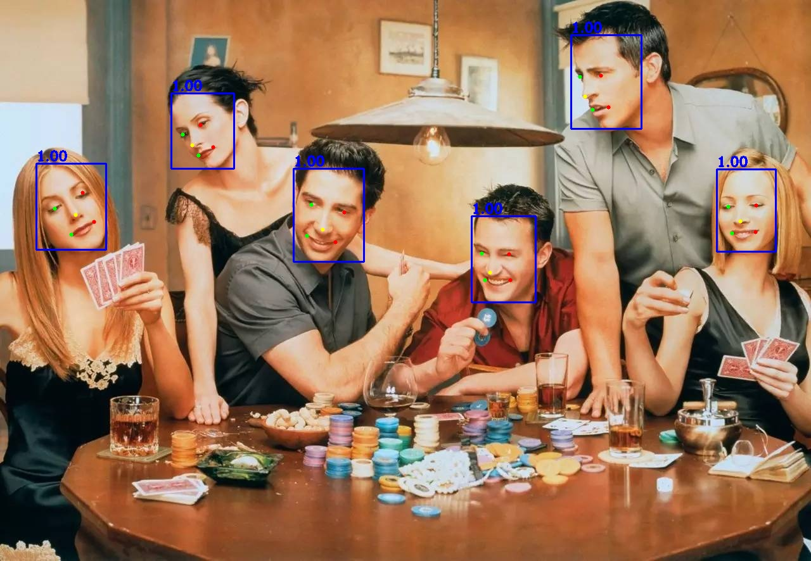

# RetinaFace Network MXNet Symbol=>ONNX=>TensorRT

## 1.Reference
- **RetinaFace github:** [https://github.com/deepinsight/insightface/tree/master/RetinaFace](https://github.com/deepinsight/insightface/tree/master/RetinaFace)
- **RetinaFace arxiv:** [RetinaFace: Single-stage Dense Face Localisation in the Wild](https://arxiv.org/abs/1905.00641)
- **get pretrained model:** [BaiduDrive](https://pan.baidu.com/s/1C6nKq122gJxRhb37vK0_LQ) or [Dropbox](https://www.dropbox.com/s/53ftnlarhyrpkg2/retinaface-R50.zip?dl=0)

## 2.Export ONNX Model
- export resnet50 model
```
python3 export_onnx.py
```
- export mobilenet 0.25 model
```
python3 export_onnx.py  --network mnet --imagenet ./model/mobilenet_0_25 --pretrained ./model/mnet.25 --transpose ./model/mnet_retinaface --onnx mnet_retinaface.onnx --input_shape 1 3 640 640
```

## 3.Build RetinaFace_trt Project
```
mkdir build && cd build
cmake ..
make -j
```

## 4.Run RetinaFace_trt
```
./RetinaFace_trt ../config.yaml ../samples
```

## 5.Inference Time Benchmark
resolution|MXNet Symbol|TensorRT|
---|---|---
640x640||13.2ms

## 6.Results
