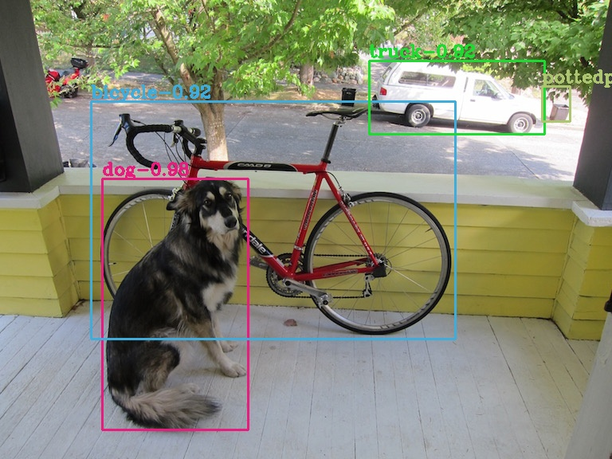

# YOLOv4 Network darknet=>ONNX=>TensorRT

## 1.Reference
- **YOLOv4:** [YOLOv4: Optimal Speed and Accuracy of Object Detection](https://arxiv.org/abs/2004.10934)
- **darknet:** [https://github.com/AlexeyAB/darknet](https://github.com/AlexeyAB/darknet)
- get YOLOv4 weights from here: [yolov4.weights](https://drive.google.com/open?id=1sWNozS0emz7bmQTUWDLvsubLGnCwUiIS)

## 2.Export ONNX Model
```
python3 export_onnx.py
```

## 3.Build Yolov4_trt Project
```
mkdir build && cd build
cmake ..
make -j
```

## 4.Run Yolov4_trt
```
./Yolov4_trt ../config.yaml ../samples
```

## 5.Inference Time Benchmark
model|resolution|darknet|TensorRT|
---|---|---|---
yolov4|416x416||4.2ms
yolov4|608x608||6.3ms
yolov4-voc_mobilenetv2|416x416||2.2ms
yolov4-voc_mobilenetv2_mish|416x416||2.5ms

## 6.Results
