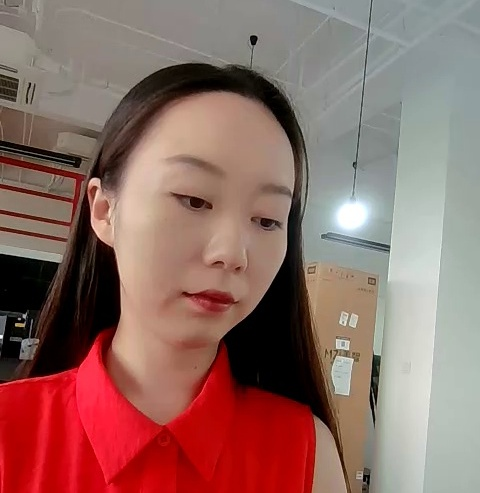
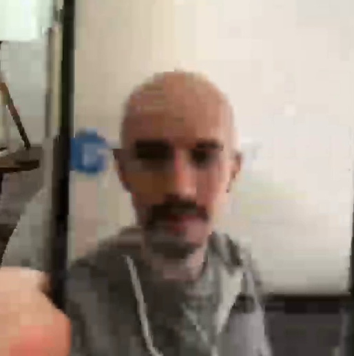

# MiniFASNet MXNet Gluon=>ONNX=>TensorRT

## 1.Reference
- **MiniFASNet github:** [https://github.com/minivision-ai/Silent-Face-Anti-Spoofing](https://github.com/minivision-ai/Silent-Face-Anti-Spoofing)

## 2.Export ONNX Model
- export 2.7_80x80_MiniFASNetV2 model
```
python3 export_onnx.py
```

- export 4_0_0_80x80_MiniFASNetV1SE model
```
python3 export_onnx.py --weights_file ./resources/anti_spoof_models/4_0_0_80x80_MiniFASNetV1SE.pth
```

## 3.Build MiniFASNet_trt Project
```
cd ../  # in project directory
mkdir build && cd build
cmake ..
make -j
```

## 4.Run MiniFASNet_trt
```
cd ../../bin/
./tensorrt_inference MiniFASNet ../configs/MiniFASNet/config.yaml ../samples/antispoofing
```
## 5.Results

name|sample|result
---|---|---
0.jpg||fake
1.jpg||fake
2.jpg||real
3.jpg||real
4.jpg||fake
5.jpg||fake
