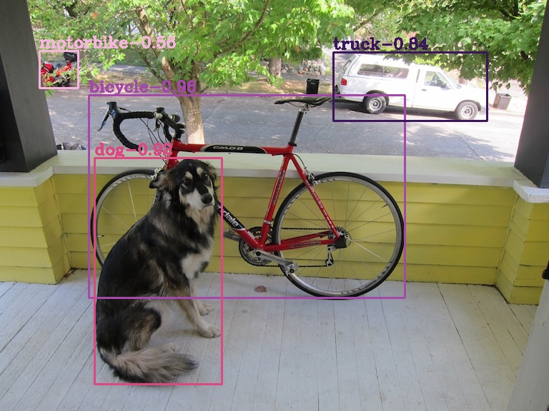

# Scaled-YOLOv4 Network PyTorch=>ONNX=>TensorRT

## 1.Reference
- **Scaled-YOLOv4:** [Scaled-YOLOv4: Scaling Cross Stage Partial Network](https://arxiv.org/abs/2011.08036)
- **github:** [https://github.com/WongKinYiu/ScaledYOLOv4](https://github.com/WongKinYiu/ScaledYOLOv4)

## 2. Model Zoo
model|weights
---|---
yolov4-p5|[weights](https://drive.google.com/file/d/1aXZZE999sHMP1gev60XhNChtHPRMH3Fz/view?usp=sharing)
yolov4-p6|[weights](https://drive.google.com/file/d/1aB7May8oPYzBqbgwYSZHuATPXyxh9xnf/view?usp=sharing)
yolov4-p7|[weights](https://drive.google.com/file/d/18fGlzgEJTkUEiBG4hW00pyedJKNnYLP3/view?usp=sharing)

## 3.Export ONNX Model
```
git clone https://github.com/linghu8812/ScaledYOLOv4.git
git fetch origin yolov4-large:yolov4-large
git checkout yolov4-large
```
copy [export_onnx.py](export_onnx.py) into `ScaledYOLOv4/models` and run `export_onnx.py` to generate `yolov4-p5.onnx` and so on.

- export yolov4-p5 onnx
```
export PYTHONPATH="$PWD" && python3 models/export_onnx.py --weights ./weights/yolov4-p5.pt --img-size 896
```
- export yolov4-p6 onnx
```
export PYTHONPATH="$PWD" && python3 models/export_onnx.py --weights ./weights/yolov4-p6.pt --img-size 1280
```
- export yolov4-p7 onnx
```
export PYTHONPATH="$PWD" && python3 models/export_onnx.py --weights ./weights/yolov4-p7.pt --img-size 1536
```

## 4.Build ScaledYOLOv4_trt Project
```
cd ../  # in project directory
mkdir build && cd build
cmake ..
make -j
```

## 5.Run ScaledYOLOv4_trt
- inference with yolov4-p5
```
cd ../../bin/
./tensorrt_inference ScaledYOLOv4 ../configs/ScaledYOLOv4/config-p5.yaml ../samples/detection_segmentation
```
- inference with yolov4-p6
```
cd ../../bin/
./tensorrt_inference ScaledYOLOv4 ../configs/ScaledYOLOv4/config-p6.yaml ../samples/detection_segmentation
```
- inference with yolov4-p7
```
cd ../../bin/
./tensorrt_inference ScaledYOLOv4 ../configs/ScaledYOLOv4/config-p7.yaml ../samples/detection_segmentation
```

## 6.Results
- yolov4-p7 predict result is shown below:


