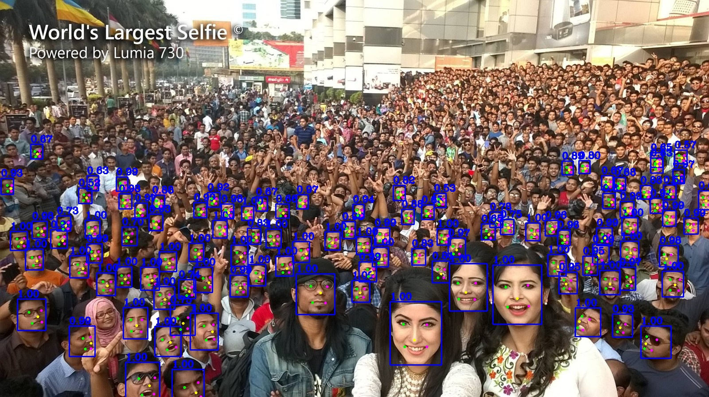

# scrfd PyTorch=>ONNX=>TensorRT

## 1.Reference
- **scrfd arxiv:** [Sample and Computation Redistribution for Efficient Face Detection](https://arxiv.org/abs/2105.04714)
- **scrfd github:** [https://github.com/deepinsight/insightface/tree/master/detection/scrfd](https://github.com/deepinsight/insightface/tree/master/detection/scrfd)

## 2. Model Zoo

|      Name      | Easy  | Medium | Hard  | FLOPs | Params(M) | Infer(ms) | Link                                                         |
| :------------: | ----- | ------ | ----- | ----- | --------- | --------- | ------------------------------------------------------------ |
|   SCRFD_500M   | 90.57 | 88.12  | 68.51 | 500M  | 0.57      | 3.6       | [download](https://1drv.ms/u/s!AswpsDO2toNKqyYWxScdiTITY4TQ?e=DjXof9) |
|    SCRFD_1G    | 92.38 | 90.57  | 74.80 | 1G    | 0.64      | 4.1       | [download](https://1drv.ms/u/s!AswpsDO2toNKqyPVLI44ahNBsOMR?e=esPrBL) |
|   SCRFD_2.5G   | 93.78 | 92.16  | 77.87 | 2.5G  | 0.67      | 4.2       | [download](https://1drv.ms/u/s!AswpsDO2toNKqyTIXnzB1ujPq4th?e=5t1VNv) |
|   SCRFD_10G    | 95.16 | 93.87  | 83.05 | 10G   | 3.86      | 4.9       | [download](https://1drv.ms/u/s!AswpsDO2toNKqyUKwTiwXv2kaa8o?e=umfepO) |
|   SCRFD_34G    | 96.06 | 94.92  | 85.29 | 34G   | 9.80      | 11.7      | [download](https://1drv.ms/u/s!AswpsDO2toNKqyKZwFebVlmlOvzz?e=V2rqUy) |
| SCRFD_500M_KPS | 90.97 | 88.44  | 69.49 | 500M  | 0.57      | 3.6      | [download](https://1drv.ms/u/s!AswpsDO2toNKri_NDM0GIkPpkE2f?e=JkebJo) |
| SCRFD_2.5G_KPS | 93.80 | 92.02  | 77.13 | 2.5G  | 0.82      | 4.3       | [download](https://1drv.ms/u/s!AswpsDO2toNKqyGlhxnCg3smyQqX?e=A6Hufm) |
| SCRFD_10G_KPS  | 95.40 | 94.01  | 82.80 | 10G   | 4.23      | 5.0       | [download](https://1drv.ms/u/s!AswpsDO2toNKqycsF19UbaCWaLWx?e=F6i5Vm) |

## 3.Export ONNX Model
- clone scrfd code from [linghu8812/scrfd](https://github.com/linghu8812/scrfd)
```
git clone https://github.com/linghu8812/scrfd.git
cd scrfd/tools
```
- export SCRFD_10G_KPS model
```
python scrfd2onnx.py ../configs/scrfd/scrfd_10g_bnkps.py ../model.pth --input-img test.jpg --shape 640 640
```
- export SCRFD_500M_KPS model
```
 python scrfd2onnx.py ../configs/scrfd/scrfd_500m_bnkps.py ../model.pth --input-img test.jpg --shape 640 640
```

## 4.Build tensorrt_inference Project
```
cd ../  # in project directory
mkdir build && cd build
cmake ..
make -j
```

## 5.Run tensorrt_inference
- inference with srcfd
```
cd ../../bin/
./tensorrt_inference scrfd ../configs/scrfd/config.yaml ../samples/faces_detection
```

For more information, please refer this blog: [https://blog.csdn.net/linghu8812/article/details/110677016](https://blog.csdn.net/linghu8812/article/details/110677016)

## 6.Results
- SCRFD_10G_KPS result


- RetinaFace R50 result



From the above image results, we can see that, the scrfd detection model can detect more faces at the same config.
